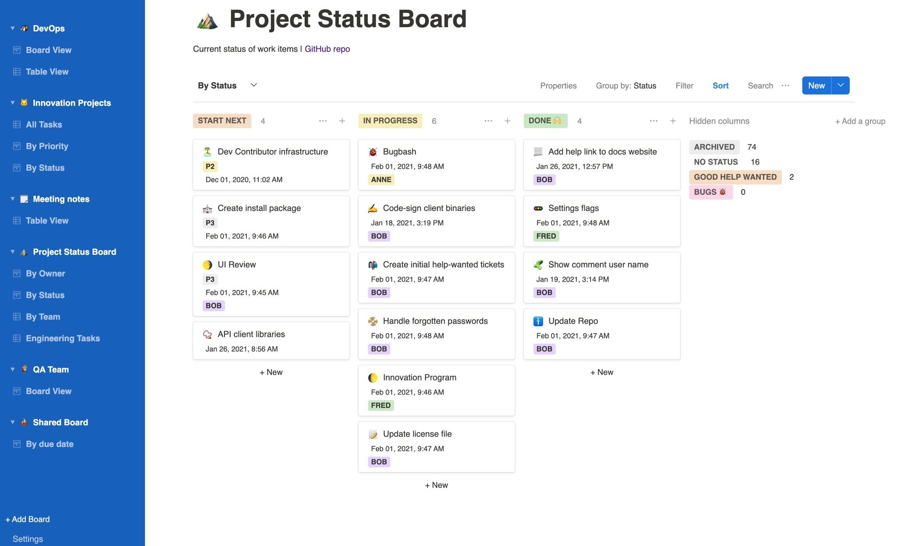

> [NOTE]
> Maintainers are more than welcome! Someone with experience of handling large open source projects. More, the merrier.
> There may be errors with Windows or Linux. Checked only for Mac in this version. If any error, this is due to some files still yet to be renamed from focal to karma.

# Karmaboard



Karmaboard is a fork of focalboard intended for Bharat use cases.
Like focalboard, this is an open source, multilingual, self-hosted project management tool that's an alternative to Trello, Notion, and Asana.

It helps define, organize, track and manage work across individuals and teams. Karmaboard comes in two editions:


### Getting started

If there are not enough developers for you here, try the [~focalboard community channel](https://community.mattermost.com/core/channels/focalboard) to connect with other developers.
focalboard also has [developer guide](https://developers.mattermost.com/contribute/focalboard/personal-server-setup-guide) which has detailed instructions on how to set up your development environment for the **Personal Server**. 


Create an `.env` file in the karmaboard directory that contains:

```
EXCLUDE_ENTERPRISE="1"
```

To build the server:

```
make prebuild
make
```

To run the server:

```
 ./bin/karmaboard-server
```

Then navigate your browser to [`http://localhost:8000`](http://localhost:8000) to access your Karmaboard server. The port is configured in `config.json`.

Once the server is running, you can rebuild just the web app via `make webapp` in a separate terminal window. Reload your browser to see the changes.

### Building and running standalone desktop apps

You can build standalone apps that package the server to run locally against SQLite:

* **Windows**:
  * *Requires Windows 10, [Windows 10 SDK](https://developer.microsoft.com/en-us/windows/downloads/sdk-archive/) 10.0.19041.0, and .NET 4.8 developer pack*
  * Open a `git-bash` prompt.
  * Run `make prebuild`
  * The above prebuild step needs to be run only when you make changes to or want to install your npm dependencies, etc.
  * Once the prebuild is completed, you can keep repeating the below steps to build the app & see the changes.
  * Run `make win-wpf-app`
  * Run `cd win-wpf/msix && karmaboard.exe`
* **Mac**:
  * *Requires macOS 11.3+ and Xcode 13.2.1+*
  * Run `make prebuild`
  * The above prebuild step needs to be run only when you make changes to or want to install your npm dependencies, etc.
  * Once the prebuild is completed, you can keep repeating the below steps to build the app & see the changes.
  * Run `make mac-app`
  * Run `open mac/dist/Karmaboard.app`
* **Linux**:
  * *Tested on Ubuntu 18.04*
  * Install `webgtk` dependencies
    * Run `sudo apt-get install libgtk-3-dev`
    * Run `sudo apt-get install libwebkit2gtk-4.0-dev`
  * Run `make prebuild`
  * The above prebuild step needs to be run only when you make changes to or want to install your npm dependencies, etc.
  * Once the prebuild is completed, you can keep repeating the below steps to build the app & see the changes.
  * Run `make linux-app`
  * Uncompress `linux/dist/karmaboard-linux.tar.gz` to a directory of your choice
  * Run `karmaboard-app` from the directory you have chosen
* **Docker**:
  * To run it locally from offical image:
    * `docker run -it -p 80:8000 mattermost/karmaboard`
  * To build it for your current architecture:
    * `docker build -f docker/Dockerfile .`
  * To build it for a custom architecture (experimental):
    * `docker build -f docker/Dockerfile --platform linux/arm64 .`

Cross-compilation currently isn't fully supported, so please build on the appropriate platform. Refer to the GitHub Actions workflows (`build-mac.yml`, `build-win.yml`, `build-ubuntu.yml`) for the detailed list of steps on each platform.

### Unit testing

Before checking in commits, run `make ci`, which is similar to the `.gitlab-ci.yml` workflow and includes:

* **Server unit tests**: `make server-test`
* **Web app ESLint**: `cd webapp; npm run check`
* **Web app unit tests**: `cd webapp; npm run test`
* **Web app UI tests**: `cd webapp; npm run cypress:ci`

### Staying informed

* **Changes**: See the [CHANGELOG](CHANGELOG.md) for the latest updates
